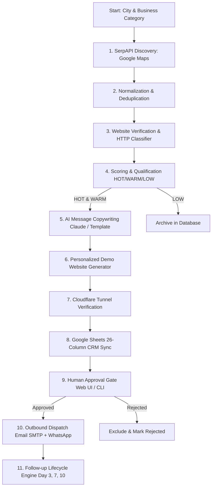

# 🚀 LeadHunter AI — Autonomous B2B Lead Engine & Agency Outreach

**LeadHunter AI** is an autonomous AI agent designed for digital agencies, freelancers, and web designers. It automatically discovers local businesses from Google Maps, verifies their online presence, scores them as high-intent prospects, builds personalized single-page demo websites, and prepares high-converting cold email & WhatsApp outreach with an interactive human approval gate.

---

## 📑 Table of Contents
1. [Architecture & Pipeline Overview](#-architecture--pipeline-overview)
2. [Quick Start & 1-Click Launch](#-quick-start--1-click-launch)
3. [Configuration & Environment Variables](#-configuration--environment-variables)
4. [Public Demo Links via Cloudflare Tunnel](#-public-demo-links-via-cloudflare-tunnel)
5. [CLI & Web Interface Usage](#-cli--web-interface-usage)
6. [Pipeline Stages Detailed](#-pipeline-stages-detailed)
7. [Automated Follow-Up Engine](#-automated-follow-up-engine)
8. [Google Sheets Integration](#-google-sheets-integration)
9. [Safety & Compliance Guardrails](#-safety--compliance-guardrails)
10. [Troubleshooting & Common Fixes](#-troubleshooting--common-fixes)

---

## 🏗️ Architecture & Pipeline Overview



---

## ⚡ Quick Start & 1-Click Launch

### Prerequisites
- **Python 3.10+** installed on your system.
- **Git** installed.
- **Cloudflared** CLI (free, optional for public links).

### 1. Installation
Clone the repository and install all dependencies:
```bash
git clone https://github.com/Rdzala30/ai-agent-freelancer.git leadhunter-ai
cd leadhunter-ai
pip install -r requirements.txt
```

### 2. Fast Launch (Windows)
Double click **`LeadHunter_Pro.bat`** in your project folder to open the master interactive menu:
```text
 [1]  🚀 Launch Web Control Center (Port 8500 + Auto-Open Browser)
 [2]  ⚡ Run Full End-to-End Pipeline (Discovery, Scoring, Demos, Outreach)
 [3]  🔍 Run Lead Discovery Only (SerpAPI Google Maps)
 [4]  🌐 Start Demo Preview Server Only (Port 8000)
 [5]  🔄 Run Automated Follow-Up Engine
 [6]  📊 Sync All Leads to Google Sheets
 [7]  🧪 Run Automated Test Suite (56 Tests)
 [8]  ❌ Exit
```

---

## ⚙️ Configuration & Environment Variables

Create a file named `.env` in the root folder with your credentials:

```env
# --- AI Message Personalization (Anthropic Claude) ---
ANTHROPIC_API_KEY=sk-ant-api03-...

# --- Google Maps Discovery ---
SERPAPI_KEY=8b9e65a6e530034833b3d1f0b555227a54e956330dc6de4324ca95a182efd643

# --- Demo Website Public URL ---
DEMO_BASE_URL=https://your-tunnel-url.trycloudflare.com

# --- Email Outreach (Gmail SMTP) ---
SENDER_EMAIL=your-real-email@gmail.com
SENDER_NAME=Your Agency Name
GMAIL_APP_PASSWORD=lmjt elgb jjim jtcx

# --- WhatsApp Cloud API (Optional) ---
WHATSAPP_TOKEN=your-meta-whatsapp-token
WHATSAPP_PHONE_NUMBER_ID=your-phone-number-id

# --- Google Sheets Integration ---
GOOGLE_SHEET_ID=1HGe8zfH3MFsCtbS0Q8UKnxIjE7G7WmQTIewRq8pchRE
GOOGLE_CREDS_PATH=./google_creds.json

# --- Safety Guardrail (true = simulation, false = live sends) ---
DRY_RUN=true
MAX_LEADS=10
```

> [!IMPORTANT]
> **Gmail App Password**: Do not use your regular Gmail password. Generate a 16-character App Password at [myaccount.google.com/apppasswords](https://myaccount.google.com/apppasswords).

---

## 🌐 Public Demo Links via Cloudflare Tunnel

By default, demo links run locally on `http://localhost:8500/preview/{slug}`. To allow business owners to open their demo website on their mobile phones:

1. Open a new terminal window.
2. Run:
   ```bash
   cloudflared tunnel --url http://localhost:8500
   ```
3. Copy the generated HTTPS address (`https://abc-xyz.trycloudflare.com`) and paste it into `DEMO_BASE_URL` in your `.env`.

---

## 💻 CLI & Web Interface Usage

### Option 1: Web Dashboard (Visual Mode)
Start the web dashboard:
```bash
python main.py --web --port 8500
```
Open **[http://localhost:8500](http://localhost:8500)** in your browser:
- **Search any city**: `Chandigarh`, `Mohali`, `Vadodara`, `Mumbai`, `Delhi`
- **Filter leads by city**: Click `📍 Chandigarh` or `📍 Mohali`
- **One-click human approvals**: Click `✓ Approve` or `✗ Reject`
- **Preview landing pages**: Click `⚡ Open Site →`

### Option 2: Command Line (Autonomous Mode)
Run full end-to-end pipeline in one command:
```bash
python main.py --all --city "Chandigarh" --category "restaurants" --limit 5
```

Run specific pipeline stages individually:
```bash
# Discovery only
python main.py --discover --city "Mohali" --category "cafes" --limit 10

# Website verification only
python main.py --verify

# Scoring & qualification only
python main.py --score

# Generate AI sales copy only
python main.py --personalize

# Generate & verify demo landing pages
python main.py --demos

# Open terminal approval gate
python main.py --approve

# Dispatch email & WhatsApp outreach
python main.py --outreach

# Sync with Google Sheets
python main.py --sync
```

---

## 📊 Pipeline Stages Detailed

| Stage | Action | Logic & Rules |
| :--- | :--- | :--- |
| **1. Discovery** | SerpAPI Google Maps | Queries local businesses, extracts ratings, reviews, phone, address, and maps URLs. |
| **2. Deduplication** | Phone & Name Matching | Deterministic `lead_id` hash prevents duplicate records. Quality score calculated (0–100). |
| **3. Verification** | HTTP Site Classifier | Classifies status: `NO_WEBSITE`, `BROKEN_WEBSITE`, `SOCIAL_ONLY`, `DIRECTORY_ONLY`, `VALID_WEBSITE`. |
| **4. Scoring** | Point Weight Engine | `NO_WEBSITE` (+40), `BROKEN_WEBSITE` (+35), `SOCIAL_ONLY` (+30), Rating $\ge$ 4.0 (+15). |
| **5. AI Copywriting** | Claude 3.5 Sonnet / Rule Engine | Generates custom subject line (<8 words), email body (<120 words), and WhatsApp pitch (<80 words). |
| **6. Demo Landing Page** | Jinja2 Preview Template | Generates a responsive mobile-friendly landing page at `/preview/{slug}`. |
| **7. Google Sheets Sync** | `gspread` + Service Account | Syncs 26 columns to the `Leads` tab and batch execution metrics to the `Runs` tab. |
| **8. Human Approval** | Interactive Gate | Leads must be marked `APPROVED` before any message can be dispatched. |
| **9. Outreach Dispatch** | Gmail SMTP + Meta Cloud API | Sends personalized emails and WhatsApp messages with rate limiting (10 emails/hr, 20 WA/hr). |

---

## 🔄 Automated Follow-Up Engine

Run the follow-up sequence engine:
```bash
python main.py --followups
```

### Follow-Up Timeline:
- **Day 0**: Initial message sent.
- **Day 3**: Follow-Up #1 dispatched (friendly check-in referencing demo preview).
- **Day 7**: Follow-Up #2 dispatched (final value proposition & question).
- **Day 10**: If no reply, automatically marked as `COLD` and archived.

### Exclusions:
The system **never** follows up if:
- Lead replied (`REPLIED`)
- Lead requested removal (`DO_NOT_CONTACT`)
- Lead converted (`CONVERTED`)
- Maximum 2 follow-ups reached.

---

## 📈 Google Sheets Integration

The system synchronizes the following 26 columns to your Google Spreadsheet:
`Lead ID` • `Business Name` • `Category` • `City` • `Phone` • `Email` • `Address` • `Website` • `Website Status` • `Lead Score` • `Lead Tier` • `Qualification Reason` • `Demo URL` • `Demo Status` • `Email Message` • `WhatsApp Message` • `Approval Status` • `Email Status` • `WhatsApp Status` • `First Contacted At` • `Last Contacted At` • `Status` • `Source` • `Created At` • `Updated At` • `Error`

---

## 🛡️ Safety & Compliance Guardrails

1. **`DRY_RUN=true` by default**: Prevents accidental messages to real business owners during testing.
2. **Human Approval Gate**: Outreach will **never** trigger unless a lead is explicitly marked `APPROVED`.
3. **Hourly Rate Limits**: Rolling window rate limiter caps sends at 10 emails/hour and 20 WhatsApp messages/hour.
4. **Anti-Spam Delays**: 3-second delay between individual emails.
5. **Resumable State**: System checks SQLite before starting any stage to avoid repeating already-completed work.

---

## 🔧 Troubleshooting & Common Fixes

| Problem | Cause | Solution |
| :--- | :--- | :--- |
| `HTTP 401: Invalid API key` | SerpAPI key is short or invalid | Copy the 64-character private key from [serpapi.com/manage-api-key](https://serpapi.com/manage-api-key). |
| `[Errno 10048] Address in use` | Port 8500 is already running | Restart the server or kill the existing process using task manager. |
| `Gmail SMTP Auth Error` | Using regular Gmail password | Generate a 16-character App Password at [myaccount.google.com/apppasswords](https://myaccount.google.com/apppasswords). |
| `Demo links fail on mobile` | Link points to `localhost` | Start Cloudflare Tunnel (`cloudflared tunnel --url http://localhost:8500`) and update `DEMO_BASE_URL`. |
| `Google Sheets Auth Error` | Missing service account email permissions | Share your Google Sheet with the `client_email` found in `google_creds.json` as **Editor**. |

---

## 📜 License
MIT License. Created for AI Freelancers and Agencies.
